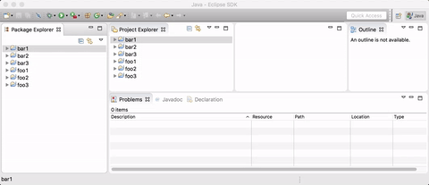

# Eclipse quicksearch plugin

## Project overview

This plugins provides extra navigation capabilities in tree-based viewers in Eclipse. If a tree is in focus then a subset of tree nodes can be selected by typing a name pattern. All nodes that match to the pattern can be selected by using the up and down arrows. The matching can be stopped with the esc key. 

## Installation

The plugin is known to work with Eclipse Mars. The update site for the latest release: https://github.com/donat/eclipse-quicksearch/releases/download/0.0.1/updatesite.zip

## Feedback

Contact me via email or raise an issue/pull request. Any feedback is appreciated.

## License

[Eclipse Public License (EPL) v1.0.](https://eclipse.org/org/documents/epl-v10.html)
